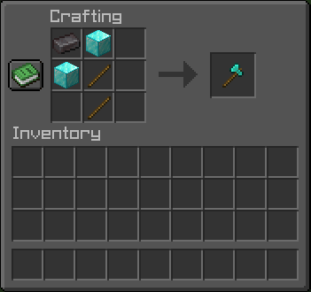
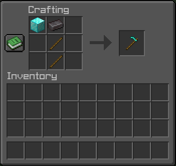

# OpTools

**Un plugin Spigot qui ajoute des items au pouvoir qui rendent le jeu agréable.**

## Présentation

**OpTools** ajoute des outils spéciaux capables de choses impossibles en vanilla.  

## Information Utiles

Tous les items restent **VANILLA**. Vous pouvez donc les fusionner avec vos outils **déjà éxistant** sans qu'ils perdent leurs pouvoirs. 
Vous pouvez aussi les améliorées en **Netherite** !

## Items disponibles
- Pioche: 
La Pioche permet de casser en **3x3** ! L'xp n'est malheureusement pas drop dû à un bug.

- Hâche 
La Hâche permet de casser **intégralement** un arbre. Les feuilles, elles, sont épargnées.

- Houe 
La Houe permet de replanté vos plantation dans un rayon de **3x3** ! Mais **ATTENTION**, les graines doivent être dans votre inventaire !

**Liste des crafts:**
- La Pioche: 

- La Hâche: 

- La Houe: 

