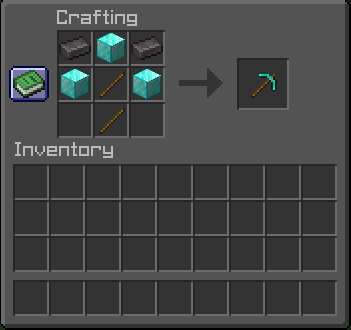

# OpTools

**Un plugin Spigot qui ajoute une pioche 3x3 pour rendre le minage plus rapide et plus agréable.**

## Présentation

**OpTools** ajoute des outils spéciaux capables de choses impossibles en vanilla (pour l'instant seulement une Pioche capable de casser en **3x3** a été implémentée).  

**Informations Utiles**

La Pioche reste entièrement **vanilla** ! Vous pouvez donc la _fusionnée_ ou _l'enchantée_ sans qu'elle perde son pouvoir.

**Liste des crafts:**
- La pioche:

